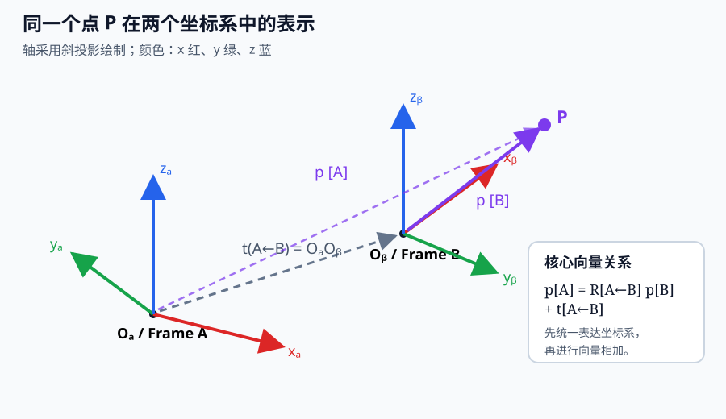

# 知识点 01：坐标系与刚体变换

## 学习目标

学完后应能：

1. 区分“一个几何点”和“这个点在某坐标系下的坐标”。
2. 解释旋转矩阵每一列的几何意义。
3. 使用旋转和平移把 B 系坐标转换到 A 系。
4. 正确进行变换复合和求逆。
5. 将公式映射到相机—机器人抓取链路。

## 1. 点不变，坐标会变

空间中的点 P 是客观存在的，但描述它的三个数字依赖参考坐标系。

- `^A p`：点 P 在 A 坐标系中的坐标
- `^B p`：同一个点 P 在 B 坐标系中的坐标

本项目统一采用**列向量**和如下记号：

- `^A R_B`：把 B 系表达的向量转换成 A 系表达
- `^A t_B`：B 系原点在 A 系中的坐标
- `^A T_B`：把 B 系坐标转换成 A 系坐标的齐次变换

注意：上下标方向是机器人系统中最常见的错误来源，不能只看矩阵数值猜含义。

## 2. 旋转加平移

对 B 系中的点 `^B p`，先把它旋转为 A 系的表达，再加上 B 原点在 A 系的位置：

$$
{}^A\mathbf p = {}^A\mathbf R_B\,{}^B\mathbf p + {}^A\mathbf t_B
$$

它的几何含义是：

$$
\overrightarrow{O_AP}=\overrightarrow{O_AO_B}+\overrightarrow{O_BP}
$$

其中 `O_B P` 原本由 B 系坐标描述，因此要乘 `^A R_B` 后才能和 A 系中的平移相加。

### 旋转矩阵的列表示什么

$$
{}^A\mathbf R_B=
\begin{bmatrix}
|&|&|\\
{}^A\mathbf x_B & {}^A\mathbf y_B & {}^A\mathbf z_B\\
|&|&|
\end{bmatrix}
$$

三列分别是 **B 系 x、y、z 轴在 A 系中的坐标**。因此旋转矩阵不是抽象数字表，而是一个坐标系的三个轴在另一个坐标系里的表示。

合法旋转矩阵满足：

$$
\mathbf R^T\mathbf R=\mathbf I,\qquad \det(\mathbf R)=1
$$

所以：

$$
\mathbf R^{-1}=\mathbf R^T
$$

## 3. 齐次变换

为了把旋转和平移统一成一次矩阵乘法，给三维点增加一个值为 1 的维度：

$$
{}^A\mathbf T_B=
\begin{bmatrix}
{}^A\mathbf R_B & {}^A\mathbf t_B\\
\mathbf 0^T & 1
\end{bmatrix},\qquad
\begin{bmatrix}{}^A\mathbf p\\1\end{bmatrix}
=
{}^A\mathbf T_B
\begin{bmatrix}{}^B\mathbf p\\1\end{bmatrix}
$$

最后一维不是另一个空间维度，而是让平移也能通过矩阵乘法表达。

## 4. 变换链

如果已知 B 到 A、C 到 B 的变换，则 C 到 A 为：

$$
{}^A\mathbf T_C={}^A\mathbf T_B\,{}^B\mathbf T_C
$$

可以像“消去中间坐标系”一样检查上下标：

$$
A\leftarrow \cancel B \quad \cancel B\leftarrow C
\quad=\quad A\leftarrow C
$$

矩阵作用顺序从右向左：先把 C 系坐标变到 B 系，再变到 A 系。矩阵乘法通常不可交换，因此顺序不能颠倒。

## 5. 逆变换

若：

$$
{}^A\mathbf T_B=
\begin{bmatrix}
\mathbf R&\mathbf t\\
0&1
\end{bmatrix}
$$

则：

$$
{}^B\mathbf T_A=({}^A\mathbf T_B)^{-1}
=
\begin{bmatrix}
\mathbf R^T&-\mathbf R^T\mathbf t\\
0&1
\end{bmatrix}
$$

注意逆变换的平移不是简单的 `-t`，因为原来的 `t` 是在 A 系表达的，还需要转换到 B 系。

## 6. 与机器人抓取的关系

抓取系统常见链路为：

$$
{}^{base}\mathbf T_{object}
={}^{base}\mathbf T_{camera}
{}^{camera}\mathbf T_{object}
$$

- 视觉模型和深度提供物体相对相机的位置/姿态。
- 手眼标定提供相机与机器人基座或末端之间的变换。
- 变换链得到物体在机器人基坐标系中的目标位姿。
- 运动学和规划器再把目标位姿转换为关节运动。

若是眼在手上，还会包含随机器人运动变化的 `base → end` 变换，不能把它误当固定外参。

## 7. 最小数值例子

假设 B 系相对 A 系绕 z 轴旋转 90°，且 B 原点在 A 系位置为 `(1, 2, 0)`：

$$
{}^A\mathbf R_B=
\begin{bmatrix}
0&-1&0\\
1&0&0\\
0&0&1
\end{bmatrix},\qquad
{}^A\mathbf t_B=
\begin{bmatrix}1\\2\\0\end{bmatrix}
$$

若点 P 在 B 系坐标为 `(1,0,0)`，则：

$$
{}^A\mathbf p=
{}^A\mathbf R_B
\begin{bmatrix}1\\0\\0\end{bmatrix}
+{}^A\mathbf t_B
=
\begin{bmatrix}0\\1\\0\end{bmatrix}
+
\begin{bmatrix}1\\2\\0\end{bmatrix}
=
\begin{bmatrix}1\\3\\0\end{bmatrix}
$$

直观解释：P 位于 B 的正 x 轴 1 米处；B 的正 x 轴在 A 看来指向正 y，因此从 `(1,2,0)` 再沿 A 的正 y 走 1 米。

## 8. 首次诊断题（不要查资料）

1. 用一句话解释 `^A R_B` 的三列分别代表什么。
2. 已知 `^A T_B` 和 `^B T_C`，写出 `^A T_C`；为什么不能颠倒顺序？
3. 在上面的数值例子中，如果 `^B p=(0,1,0)`，求 `^A p`。
4. 为什么 `T` 的逆变换中平移项是 `-R^T t`，而不只是 `-t`？
5. 工程题：相机识别出的物体位置很稳定，但机器人移动后抓取点整体偏移。请列出两个优先检查的坐标变换问题。

答题后记录：正确项、犹豫项、错误原因，并安排第 1/3/7/14 天复习。
